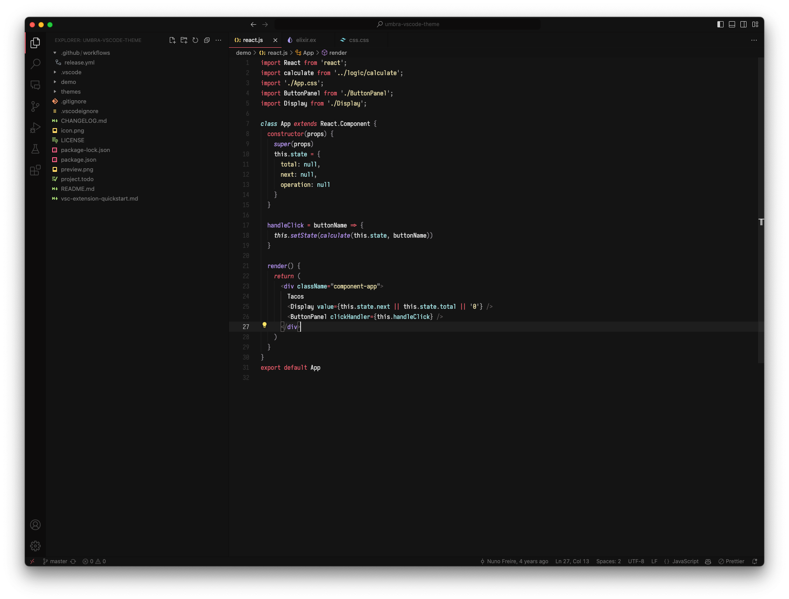

# Umbra

A Visual Studio theme with dark colors inspired by the GitHub color scheme and Monokai Pro.

## Motivation

I wanted a theme with a dark window based on GitHub syntax color scheme because it is simple and consistent. Red and Black is always a great combo.

## Issues

This is a work in progress, any issues with the theme or tweaks to the languages tokens, please use GitHub issues.
